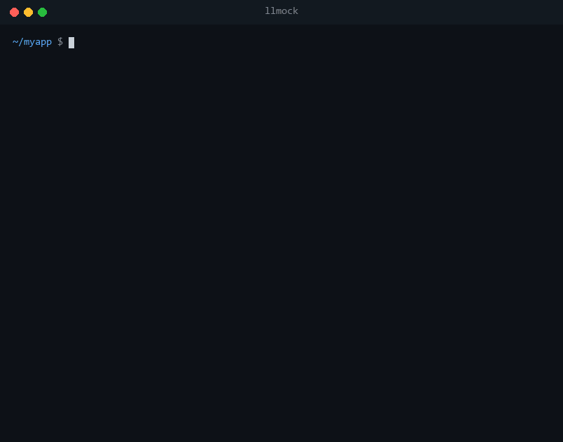

<p align="center">
  
  
  
  <a href="https://github.com/JulienRabault/LLMock/actions/workflows/ci.yml"></a>
  
  <a href="https://github.com/JulienRabault/LLMock/stargazers"></a>
</p>

<h1 align="center">LLMock</h1>

<p align="center">
<b>Chaos engineering for LLM apps.</b><br>
Break your app the way OpenAI, Anthropic and Gemini actually fail —<br>
then find out whether it recovered, or only <i>looked</i> like it did.
</p>

<p align="center"></p>

---

Your LLM calls will hit rate limits, dropped connections and streams that stop halfway. Most apps are never tested against any of it, because the real APIs cost money and won't fail on cue.

LLMock is a local server that speaks the HTTP of **10 providers**. Point your SDK at it, script the failure, run your real code — then LLMock tells you what your client got wrong. No API key, no tokens spent, deterministic.

## 30 seconds, with pytest

```bash
pip install llmock
```

Installing LLMock gives every test an `llmock` fixture. It starts a real server and points the OpenAI, Anthropic, Gemini and Cohere SDKs at it through the environment — **your application code does not change**.

```python
# test_resilience.py
from myapp import summarize          # builds openai.OpenAI() as usual

def test_survives_rate_limits(llmock):
    llmock.rate_limit(times=2, retry_after=0.5)
    assert summarize("Q3 report")
    llmock.assert_resilient()        # fails with the verdict if the client misbehaved

def test_does_not_trust_a_truncated_stream(llmock):
    llmock.truncate(after_chunks=3)
    summarize("Q3 report", stream=True)
    llmock.assert_resilient()        # truncated_stream_accepted, unless you handled it
```

`pytest --llmock-report` prints the verdict of every test whose client mishandled a fault.

## What your SDK does when a stream breaks

We ran the official SDKs against every stream fault. They disagree — and some faults are completely silent:

| Fault | openai 3.18 | anthropic 1.8 | google-genai 2.25 | cohere 7.1 |
|---|---|---|---|---|
| connection dropped mid-stream | `APIConnectionError` | raw `httpx` `RemoteProtocolError` ⚠️ | raw `httpx` `RemoteProtocolError` ⚠️ | raw `httpx` `RemoteProtocolError` ⚠️ |
| stream ends early, no finish reason | **nothing raised** 🔇 | **nothing raised** 🔇 | **nothing raised** 🔇 | **nothing raised** 🔇 |
| a chunk that is not valid JSON | raw `JSONDecodeError` ⚠️ | raw `JSONDecodeError` ⚠️ | `UnknownApiResponseError` | **chunk skipped, `COMPLETE`** 🔇 |

⚠️ not an exception from the SDK's own hierarchy: `except anthropic.APIError` does not catch it.<br>
🔇 no error at all: the app carries on with part of an answer.

One exception: the OpenAI **Responses API** stream helper, `client.responses.stream()`, raises when `response.completed` never arrives. Iterating `create(stream=True)` by hand does not.

LLMock reproduces each of these on demand, so you can write the handling and prove it works.

## Run your agent against it

In `tool_mode="auto"` (the default), a request that offers tools gets a tool call: the tool that best matches the prompt, with arguments generated from its JSON Schema. Once the tool's result comes back, LLMock answers in text. So a real agent **runs its real tools, then terminates**:

```python
from agents import Agent, Runner, function_tool   # the OpenAI Agents SDK

@function_tool
def get_weather(city: str) -> str:
    """Get the current weather for a city."""
    return f"21C in {city}"

agent = Agent(name="Weather", instructions="Help with the weather.", tools=[get_weather])
result = Runner.run_sync(agent, "What's the weather in Paris?")
# get_weather really ran, with city="mock-city"; result.final_output is set
```

Checked end to end with the OpenAI Agents SDK, an OpenAI chat loop, an Anthropic loop, and google-genai's automatic function calling. Then break it on purpose:

```python
llmock.break_tool_call("malformed_arguments")       # arguments that are not JSON
llmock.break_tool_call("unknown_tool")              # a tool that was never offered
llmock.call_tool("get_weather", {"city": "Paris"})  # or script the exact call
```

Structured output works as well: `client.chat.completions.parse(response_format=Invoice)`, `client.responses.parse(text_format=Invoice)` and Gemini's `response_schema` return objects that pass your pydantic validation.

## The faults

| | pytest | anywhere else |
|---|---|---|
| HTTP error, any 4xx/5xx | `llmock.fail(503)` | `{"type": "fail", "status": 503}` |
| 429 with a Retry-After | `llmock.rate_limit(retry_after=2)` | `{"type": "fail", "status": 429, "retry_after": 2}` |
| provider down | `llmock.outage()` | `{"type": "fail", "status": 503, "times": null}` |
| prompt too long | `llmock.context_overflow()` | `--context-window 8000` |
| real quotas | `llmock.limits(rpm=60, tpm=90_000)` | `--rpm 60 --tpm 90000` |
| slow response | `llmock.delay(3)` | `{"type": "delay", "seconds": 3}` |
| connection dropped mid-stream | `llmock.disconnect(after_chunks=3)` | `{"type": "stream_fault", "kind": "disconnect"}` |
| stream ends early, silently | `llmock.truncate(after_chunks=3)` | `{"type": "stream_fault", "kind": "truncate"}` |
| corrupted chunk | `llmock.corrupt(after_chunks=3)` | `{"type": "stream_fault", "kind": "malformed"}` |
| stream hangs | `llmock.stall(seconds=30)` | `{"type": "stream_fault", "kind": "stall"}` |
| slow first token | `llmock.slow_first_token(2)` | `{"type": "slow_first_token", "seconds": 2}` |
| scripted answer | `llmock.reply("...")` | `{"type": "reply", "text": "..."}` |
| scripted tool call | `llmock.call_tool("name", {...})` | `{"type": "reply", "tool_calls": [...]}` |
| broken tool call | `llmock.break_tool_call()` | `{"type": "tool_fault", "kind": "unknown_tool"}` |

Every behaviour takes `times=N` (or `times=None` for permanent) and can target a `provider`, `model` or path. They compose: `llmock.call_tool("search").disconnect(after_chunks=2)` starts a tool call, then drops the connection.

Quotas are not a coin toss: requests and tokens per minute refill continuously, a refused request gets a `Retry-After` equal to the real wait, and every response carries rate-limit headers in the provider's format (`x-ratelimit-*`, `anthropic-ratelimit-*`) for clients that regulate themselves.

## The verdict

LLMock sees every attempt and its timing, so it grades the client instead of only breaking it. Attempts of one call are grouped by their request body:

| | Finding | Means |
|---|---|---|
| FAIL | `retry_after_ignored` | retried before Retry-After elapsed |
| FAIL | `retried_non_retryable` | retried a 400, 401, 403, 404 or 422 |
| FAIL | `retry_storm` | more than 10 attempts for one call |
| FAIL | `truncated_stream_accepted` | used a stream that ended without a finish reason |
| WARN | `no_backoff` | retried immediately, or at a constant interval |
| WARN | `gave_up` | did not retry a retryable failure |
| WARN | `no_read_timeout` | sat through a whole stalled stream |
| WARN | `malformed_chunk_ignored` | carried on after a corrupted chunk |

`llmock.assert_resilient()` fails on errors, `assert_resilient(strict=True)` on warnings too. Outside pytest: `GET /_llmock/verdict`, or `llmock report` in CI.

## Not using pytest? Not using Python?

Run the server and drive it over HTTP, from any language:

```bash
llmock serve                                     # http://127.0.0.1:8000
curl -X POST localhost:8000/_llmock/scenario -d '{"behaviors": [
  {"type": "fail", "status": 429, "retry_after": 1, "times": 2},
  {"type": "stream_fault", "kind": "truncate", "after_chunks": 3}
]}'
# ... run your Node, Go or Rust tests against http://127.0.0.1:8000 ...
llmock report                                    # exits 1 if the client misbehaved
```

| Endpoint | |
|---|---|
| `POST /_llmock/scenario` | queue behaviours |
| `GET /_llmock/scenario` | behaviours still waiting |
| `GET /_llmock/requests` | every request, with its timing and the fault it got |
| `GET /_llmock/verdict` | the verdict as JSON, or `?format=text` |
| `POST /_llmock/reset` | forget requests and behaviours |

Or leave chaos running for a whole session:

```bash
llmock serve --error-rate 429=0.2 --stream-fault truncate=0.1 --rpm 60 --report
```

## Providers

| Provider | Base URL | Streaming | Tools |
|---|---|---|---|
| OpenAI chat | `http://127.0.0.1:8000/v1` | ✅ | ✅ |
| OpenAI Responses API | `http://127.0.0.1:8000/v1` | ✅ | ✅ |
| Anthropic | `http://127.0.0.1:8000/anthropic` | ✅ | ✅ |
| Google Gemini | `http://127.0.0.1:8000/gemini` | ✅ | ✅ |
| Cohere v2 | `http://127.0.0.1:8000/cohere` | ✅ | ✅ |
| Mistral | `http://127.0.0.1:8000/mistral/v1` | ✅ | ✅ |
| Groq | `http://127.0.0.1:8000/groq/openai/v1` | ✅ | ✅ |
| Together AI | `http://127.0.0.1:8000/together/v1` | ✅ | ✅ |
| Perplexity | `http://127.0.0.1:8000/perplexity/v1` | ✅ | ✅ |
| AI21 | `http://127.0.0.1:8000/ai21/v1` | ✅ | ✅ |
| xAI (Grok) | `http://127.0.0.1:8000/xai/v1` | ✅ | ✅ |

Error bodies, stream events and rate-limit headers follow each provider's own format, checked against the official SDKs. Embeddings, images, models and batch endpoints are there too.

```python
openai.OpenAI(base_url="http://127.0.0.1:8000/v1", api_key="anything")
anthropic.Anthropic(base_url="http://127.0.0.1:8000/anthropic", api_key="anything")
genai.Client(api_key="anything", http_options={"base_url": "http://127.0.0.1:8000/gemini"})
```

LangChain, LlamaIndex, CrewAI and anything else built on these SDKs work unchanged: see the [examples](examples/README.md).

## Why not just mock the SDK?

Patching `client.chat.completions.create` with `unittest.mock` tests your business logic, and that is fine. It does not test the HTTP layer: retries, `Retry-After`, connection errors, provider error payloads, or what happens halfway through a stream. Frameworks such as LangChain often bypass a patched method entirely.

LLMock is a real server. Your SDK builds a real request, sends it over a real socket, and parses a real response — or a real failure.

If your stack is JavaScript, [AIMock](https://github.com/CopilotKit/aimock) is excellent. LLMock is the Python-native option, with a pytest fixture and a verdict on how your client behaved.

## Configuration

| Flag | Env var | Default | |
|---|---|---|---|
| `--host`, `--port` | `LLMOCK_HOST`, `LLMOCK_PORT` | `127.0.0.1:8000` | bind address |
| `--latency-ms` | `LLMOCK_LATENCY_MS` | `0` | delay before every answer |
| `--error-rate STATUS=RATE` | `LLMOCK_ERROR_RATE_<STATUS>` | — | random HTTP errors |
| `--stream-fault KIND=RATE` | `LLMOCK_STREAM_FAULT_<KIND>` | — | random stream faults |
| `--stream-chunk-delay-ms` | `LLMOCK_STREAM_CHUNK_DELAY_MS` | `0` | pace streams like real generation |
| `--rpm`, `--tpm` | `LLMOCK_RPM`, `LLMOCK_TPM` | — | quotas per API key |
| `--context-window` | `LLMOCK_CONTEXT_WINDOW` | — | reject prompts above this many tokens |
| `--tool-mode` | `LLMOCK_TOOL_MODE` | `auto` | `auto` calls offered tools, `off` never does |
| `--response-style` | `LLMOCK_RESPONSE_STYLE` | `varied` | `static`, `hello`, `echo`, `varied` |
| `--report` | `LLMOCK_REPORT` | off | print the verdict on shutdown |
| `--config` | `LLMOCK_CONFIG` | — | a JSON or YAML file, see the [example](examples/llmock.example.yaml) |

Flags win over environment variables, which win over the config file. `/health` and `/_llmock/*` bypass chaos.

The admin API has no authentication: keep LLMock on `127.0.0.1`, the default, unless the network is trusted.

## Common questions

**How do I test OpenAI rate limit handling without calling the API?**
`llmock.rate_limit(times=2, retry_after=1)` in pytest, or `llmock serve --rpm 10` for a real quota. Then `llmock.assert_resilient()` checks that your client waited as long as `Retry-After` asked.

**How do I simulate a 429, 500 or 529 from Anthropic or Gemini?**
`llmock.fail(529, provider="anthropic")`. The body is Anthropic's own `overloaded_error`, so the SDK raises `anthropic.OverloadedError` exactly as in production.

**How do I test what happens when an LLM stream disconnects?**
`llmock.disconnect(after_chunks=3)` drops the connection after three chunks. `llmock.truncate(after_chunks=3)` ends the stream cleanly but early, which no SDK reports.

**How do I test a LangChain or OpenAI Agents SDK agent offline?**
Point it at LLMock: it calls your tools with schema-valid arguments, answers once their results come back, and never costs a token.

**Is the output deterministic?**
The same request gets the same text in every process, so snapshot tests are stable. Ids and timestamps vary, as they do in the real APIs.

## Contributing

Bug reports and pull requests are welcome: see [CONTRIBUTING.md](CONTRIBUTING.md) and [ARCHITECTURE.md](ARCHITECTURE.md).

```bash
pip install -e ".[dev,e2e]"
pytest
```

The suite drives the real OpenAI, Anthropic, Gemini, Cohere and OpenAI Agents SDKs against a live server, on Linux, macOS and Windows.

[Changelog](CHANGELOG.md) · [Security](SECURITY.md) · [Code of conduct](CODE_OF_CONDUCT.md) · MIT
